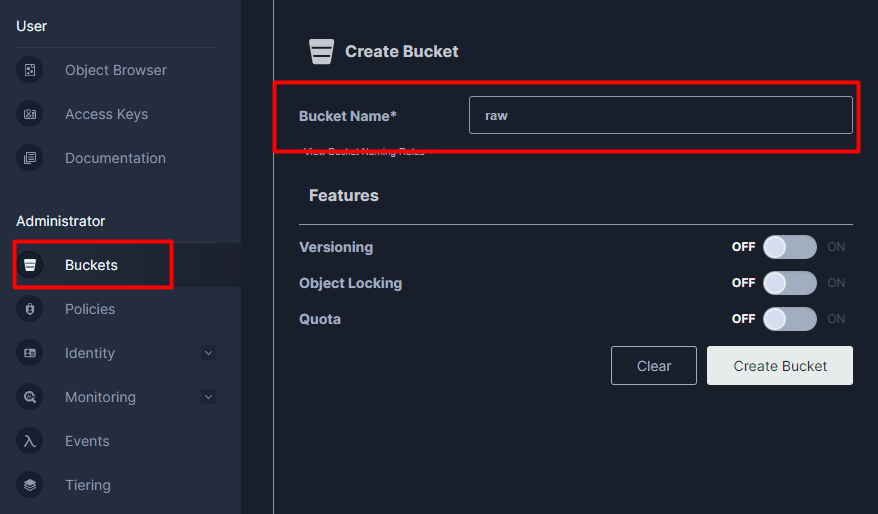

# LAB  Nifi

---
## Disclaimer
> **Esta configuração é puramente para fins de desenvolvimento local e estudos**
> 

---

# Nifi

## Subindo o ambiente docker com NIFI

> [!IMPORTANT]
> Observe o docker compose, o serviço do NIFI


```bash
docker compose up -d nifi minio
```

> https://localhost:9443/nifi/#/login


|Usuário|Senha|
|------------------|--------------|
|admin|fia@2024@ladata@laboratorio|


## Criando o Process Group

Process Group (Grupo de Processos) é um agrupador lógico que organiza um conjunto de processadores e outros componentes do fluxo de dados


## Criando o Processor

Os Processors são os principais componentes do Apache NiFi responsáveis por manipular, transformar e mover dados dentro de um fluxo. Cada Processor tem uma função específica, como ler arquivos, fazer requisições HTTP, converter formatos, filtrar registros, gravar em banco de dados, entre outras.

### Criando nosso primeiro processor com o  GetFile

Crie um Process do tipo GetFile 


### Configurando GetFile

|Property|Value|
|------------------|--------------|
|Input Directory|/files|
|File Filter|.*\.csv$|


> [!IMPORTANT]
> Configura os dados da aba Scheduling


---

### Parameter Context

No Apache NiFi, Contexto de Parâmetros é um recurso que permite centralizar e gerenciar configurações reutilizáveis dentro de um fluxo de dados. Ele possibilita definir valores parametrizáveis para processadores, permitindo maior flexibilidade e facilidade na manutenção dos fluxos.


### Os principais benefícios incluem:
* Reutilização – Um único conjunto de parâmetros pode ser aplicado a vários componentes.
* Segurança – Parâmetros sensíveis, como credenciais, podem ser protegidos.
* Facilidade de Alteração – Ajustes podem ser feitos sem modificar diretamente os fluxos.


|Name|Value|
|------------------|--------------|
|DirectoryCSV|/files|
|RecordReader|CSVReader|
|RecordWriter|JsonRecordSetWriter|
|EndPoint-Minio|http://minio:9000|


Para atribuir um Contexto de Parâmetro a um Grupo de Processos, clique em Configurar, na Paleta de Operação ou no menu de contexto do Grupo de Processos.


### Como usar os parametros nos Processor??

Edita o GetFile, botão direito, Configure >> Properties
|Property|Value|
|------------------|--------------|
|Input Directory|#{DirectoryCSV}|


## Fazendo a ingestão com MinIO, mas antes...


### Configurando MinIO

Acesso para o MinIO http://localhost:9001/login

* Senha : admin
* password: minioadmin


### Configurando o MinIO

> [!IMPORTANT]
> Crie a camada Raw ou Bronze caso não tenha ainda





---

## Controller Services
No Apache NiFi, os Controller Services são componentes compartilháveis que fornecem funcionalidades comuns a vários processadores dentro de um fluxo de dados. Eles permitem centralizar configurações e melhorar a eficiência do processamento.

Exemplos de Controller Services:
* DBCPConnectionPool – Gerencia conexões com bancos de dados.
* SSLContextService – Configura SSL/TLS para comunicação segura.
* AvroSchemaRegistry – Define esquemas de dados Avro para validação.


### Criando Controller Services `AWSCredentialsProviderControllerService` para autenticação do MinIO.

Botão direito, Controller Services.


|Property|Value|
|------------------|--------------|
|Access Key ID|cursolab|
|Secret Access Key|cursolab|


### Criando o Processor `UpdateAttribute`

Crie as propriedades abaixo:

|Property|Value|
|------------------|--------------|
|day|${now():format("dd")}|
|month|${now():format("MM")}|
|timestamp|${now():format("yyyyMMdd_HHmmss")}|
|year|${now():format("yyyy")}|

### Criando o Processor `PutS3Object`


|Property|Value|
|------------------|--------------|
|Bucket|raw|
|AWS Credentials Provider Service|AWSCredentialsProviderControllerService|
|Object Key|csv/movies/year=${year}/month=${month}/day=${day}/${filename:substringBeforeLast('.csv')}_${timestamp}.csv|
|Endpoint Override URL|#{EndPoint-Minio}|


> [!IMPORTANT]
> De permissão na pasta `files`

```bash

sudo -s
chmod -R 777 files

```

Na pasta 19.Data-Flow-Nifi\util tem o a arquivo usuarios.csv, copie e cole para a pasta files


